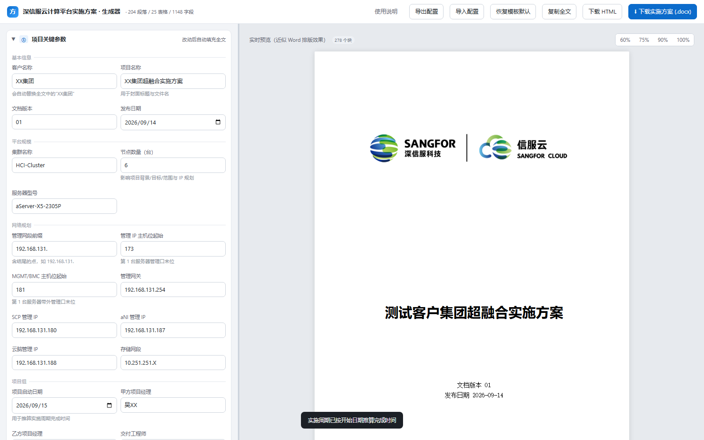
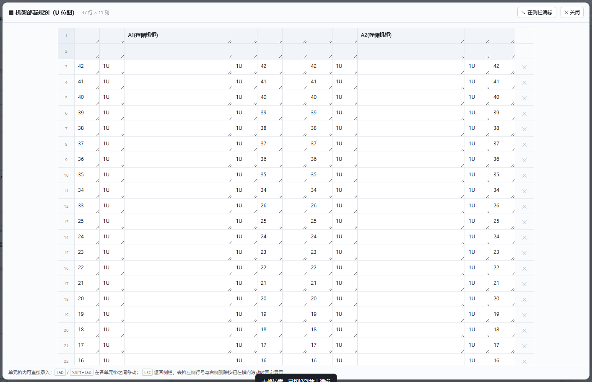
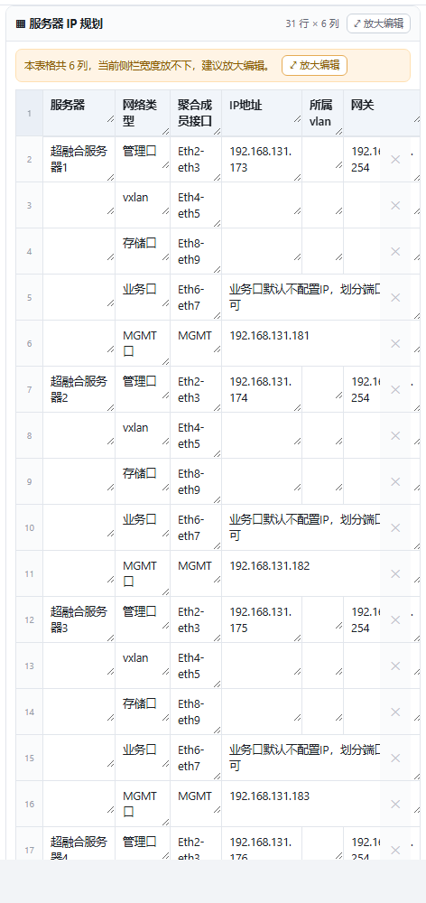

# 深信服云计算平台实施方案生成器

> 把一份 `.docx` 实施方案模板，变成**一个能填写、能实时预览、能导出保留原格式 Word 的单文件 HTML 工具**。


---

## 这是什么

做交付的同学都遇到过同一件事：一份几十页的实施方案模板，每次新项目都要把客户名称、节点数量、IP 地址、负责人挨个替换一遍。改漏一处、IP 算错一位、机架图没跟着更新，评审时就会被打回来。

这个工具把这件事变成填表：

- 左侧是**表单**（22 个关键参数 + 按模板章节顺序排列的全部正文/表格字段）
- 右侧是**实时预览**，近似 Word 排版效果
- 改完点一下，导出一个 **100% 保留原模板框架、顺序、样式、页眉页脚、拓扑图**的 `.docx`

整个工具是**一个 1.26 MB 的 HTML 文件**，零依赖、离线可用，双击就能开。



## 特性

| | |
|---|---|
| **单文件离线运行** | 产物是一个自包含 HTML，不需要服务器、不需要联网、不装任何东西 |
| **格式 100% 保真** | 不重建文档 —— 直接以原 `.docx` 包为基底替换文本，样式/编号/主题/图片/页眉页脚/页面设置原样复用 |
| **参数联动** | 在「项目关键参数」里改客户名、节点数、网段，全文对应位置自动同步；已被手工改过的字段不会被覆盖 |
| **自动生成** | 按节点数生成 6×5 的服务器 IP 规划表；按项目开始日期自动排期 |
| **大表可编辑** | 列宽按模板真实比例渲染，宽表自动进入「放大编辑」浮层（见下） |
| **自动保存** | 所有输入实时存 localStorage，中途关闭不丢；支持配置导出/导入 JSON |
| **完全可二次开发** | 换模板只需改配置块与表号，前端 `app_template.html` 无需改动 |

## 快速开始

### 直接使用

双击 `深信服云计算平台实施方案生成器.html`（Chrome / Edge），填写左侧表单，点右上角 **下载实施方案 (.docx)**。

> 首次用 Word 打开时目录可能显示旧标题 —— 已开启「打开时更新域」；若仍是旧的，`Ctrl+A` 再 `F9` 即可刷新。

### 重新构建

```bash
cd 生成器源码

# 1) 解析模板（只在模板本身变化时需要重跑）
python parse_template.py
#    → template_model.json / template_fields.json / template_outline.txt

# 2) 生成单文件 HTML
python build_app.py
#    → ../深信服云计算平台实施方案生成器.html
```

只需 **Python 3.8+ 标准库**，无第三方依赖。两个脚本都用相对路径定位文件，整个目录可以随意拷贝、改名、搬到别处。
（`parse_template.py` 默认用项目根目录下的模板；要换模板就把路径作为参数传进去。）

## 项目结构

```
.
├── 深信服云计算平台实施方案生成器.html      # ← 最终产物（单文件，离线可用）
├── 深信服云计算平台实施方案-XX集团(2).docx  # 模板原始文档
├── README.md / LICENSE
├── docs/                                    # README 截图
├── 生成器源码/
│   ├── parse_template.py     # 解析 docx → 模板模型（占位符化）
│   ├── build_app.py          # 模板相关的业务配置 + 注入构建
│   ├── app_template.html     # 前端应用（通用，与具体模板无关）
│   ├── template_model.json   # 解析产物：占位符化的 document.xml + 其余部件
│   ├── template_fields.json  # 字段清单（人工核对用）
│   └── template_outline.txt  # 章节大纲（人工核对用）
└── _backup/                  # 改动前快照，可回滚
```

## 技术原理

**核心决策：不重建文档。**

常规做法是把 docx 解析成 Markdown/HTML、编辑后再重新生成 OOXML —— 这条路几乎必然丢格式（样式继承、表格合并、编号、域、浮动图形都是坑）。这里反过来：

1. **占位符化** — 以原 `.docx` 包为基底，只把 `word/document.xml` 里每个文本节点替换成唯一占位符 `__TK_0001__`。段落属性 `pPr`、字符属性 `rPr`、单元格属性 `tcPr`（合并/底纹/边框）、图片、书签、`sectPr` 全部原样留在原位。
   - 解析器自己写标签扫描器定位元素区间（`xml.parsers.expat` 的 `CurrentByteIndex` 是**字节**索引，中文文档会整体错位）。
   - 含 `w:drawing / w:pict / w:fldSimple / w:instrText / w:fldChar` 的元素**跳过不动** —— 目录域、流程图、SmartArt 必须原样保留。
2. **注入** — 生成的 HTML 里同时内嵌：原 docx 的 base64（提供所有非 `document.xml` 部件与图片）+ 占位符化的 `document.xml`。
3. **浏览器端生成** — `DecompressionStream('deflate-raw')` 解压 → `DOMParser` 解析 → 直接在 DOM 上把占位符换回用户输入 → `XMLSerializer` 序列化 → 自写 ZIP 打包器重打包（非 `document.xml` 的条目直接复制原始压缩字节，无需重新压缩）。
4. **参数联动** — 给 token 挂公式模板（`{customer}`、`{nodes*2}`、`{mgmtStart+3}`），参数变化时只刷新**未被手工编辑过**的字段，实现「改一处、全文同步」。

## 内置模板内容

解析自 `深信服云计算平台实施方案-XX集团(2).docx`：

- **204** 段落 / **25** 张表格 / **1148** 个占位字段（其中 49 个由公式自动计算）
- **22** 个章节卡片、**22** 个可配置参数（基本信息 / 平台规模 / 网络规划 / 项目组）

<details>
<summary>展开查看全部 25 张表格</summary>

| # | 表格 | # | 表格 |
|---|---|---|---|
| 1 | 修订记录 | 14 | 平台组件 IP 规划 |
| 2 | 符号说明 · 图形标志 | 15 | SCP 配置推荐 |
| 3 | 符号说明 · 界面格式 | 16 | 云主机最佳实践 · 计算 |
| 4 | 物料清单 · 硬件设备 | 17 | 云主机最佳实践 · 内存/磁盘/网络 |
| 5 | 物料清单 · 线材 | 18 | 业务迁移方式 |
| 6 | 设备规格参数 | 19 | 项目组成员 |
| 7 | 设备命名规范 | 20 | 项目实施周期 |
| 8 | **机架部署规划（U 位图）** | 21 | 实施前准备 · 工具材料 |
| 9 | 网络平面说明 | 22 | 平台可靠性测试项 |
| 10 | **服务器 IP 规划** | 23 | 平台功能及性能测试项 |
| 11 | 设备接线表 | 24 | 产品培训计划 |
| 12 | 平台资源规划 | 25 | 项目验收材料 |
| 13 | 备份容量规划 | | |

</details>

## 表格编辑设计说明

宽表是这个工具最容易翻车的地方。左侧编辑栏只有几百像素，一张 11 列的表如果交给浏览器自适应列宽，**每格只剩 25px** —— 文字被截成单个字符，鼠标根本点不中：

| 改前 | 改后 |
|---|---|
|  |  |
| 11 列平分 347px，每格 **25.3 × 29 px**，13/13 格低于可用阈值 | 放大编辑浮层，窄列 46px / 设备名列 198px，**无横向滚动** |

现在的规则：

1. **列宽取自 docx 的真实 `<w:tblGrid>` 比例**，缩放到「最窄列 = 46px」，上限 280px；`table-layout: fixed` + `<colgroup>`。合并单元格按 `w:tcPr/w:gridSpan` 还原 `colspan`，保证同一张表内每行的列都对得齐。
2. **整表宽度** = `max(自然宽度, min(容器宽, 自然宽 + 260px))` —— 窄表铺满卡片，宽表不被拉成夸张比例，容器不够时横向滚动。
3. **宽表自动进「放大编辑」浮层**：展开时若自然宽度超过可用宽 1.25 倍就直接打开，也可以随时点标题栏 `⤢ 放大编辑`。浮层的实现是把 `.tbl-bd` 节点搬进浮层、关闭时再搬回去 —— **不重新渲染**，所以数据绑定和增删行逻辑原样复用。
4. **左右分栏可拖拽**（宽度记忆），宽表最直接的逃生通道。
5. 行号列 `sticky left`、删除列 `sticky right`（横向滚动时固定）；多行表头吸顶；删除按钮 `tabindex="-1"` 让 `Tab` 只在单元格之间跳。

其余两张典型表格：

| 服务器 IP 规划（6 列，侧栏内横向滚动） | 小表（2~3 列）自动铺满卡片 |
|---|---|
|  |  |
| 表头吸顶、行号列固定在左侧，滚动时不会丢失所在行 | 不会缩成卡片中间孤零零的一小块 |

## 二次开发：换成你自己的模板

1. 把你的 `.docx` 放到项目根目录，重新解析：

   ```bash
   python parse_template.py "你的模板.docx"     # 省略参数则用默认模板
   ```

   - 模板若使用私有样式名，改 `parse_template.py` 的 `STYLE_MAP`（样式名 → 标题层级）。
     样式不在表里时会退化用段落自带的 `w:outlineLvl` 推断层级，用标准标题样式的模板一般无需改动。
2. 修改 `build_app.py`。**与具体模板绑定的只有这几处**，其余代码通用：
   - `PARAMS` — 左侧「项目关键参数」的字段定义（key / 分组 / 标签 / 默认值 / 类型 / 提示）
   - `LITERAL_RULES` — 文本联动规则（把模板里的固定值替换成 `{参数}` 模板）
   - `TABLE_META` — 每张表格的标题、表头行数、是否允许增删行、是否有自动生成器
   - `SCHEDULE_DAYS` — 实施周期各阶段的默认工期
   - 中段几处**按表号定位**的生成逻辑（修订记录版本号 / 物料清单数量 / 项目组成员姓名 /
     服务器 IP 规划 / 实施周期预填）。表号与 `TABLE_META` 的编号一一对应，换模板时核对一遍即可 ——
     取单元格用的是 `tc(表号, 行号, 列号)`，表号对不上只会返回 `None`（打印警告），不会崩。
3. `python build_app.py` 重新生成。

`app_template.html` 是完全通用的前端：章节卡片、表格编辑器、放大编辑浮层、实时预览、docx 打包
都是模板无关的，换模板不需要改它。

## 验证

应用内置了一个端到端自检，加 `?selftest=1` 打开即可：

```
深信服云计算平台实施方案生成器.html?selftest=1
```

它会自动：改参数 → 校验联动文本是否写对 → 调生成器 → 生成 `.docx` 的 base64 → 重新解包校验。

无头环境下用 CDP 驱动 Chrome 跑同一套自检（Node 内置 `WebSocket` 直连 DevTools，不需要 puppeteer）：

```bash
chrome --headless=new --disable-gpu --remote-debugging-port=9333 \
       --user-data-dir=<tmp> "file:///…生成器.html?selftest=1"
# 然后 Runtime.evaluate({expression:'window.__selfTest()', awaitPromise:true, returnByValue:true})
```

注意**不要用 `--dump-dom` 代替**：虚拟时间下流式解压不会推进，拿到的是未初始化的 DOM。

当前产物的实测结果：

```
模板结构      204 段落 / 25 表格 / 1148 字段 / 22 章节
可编辑单元格  全部 25 张表最小 46px，低于 40px 的单元格：0 个
导出 docx     819,477 字节 / 46 个 zip 条目 / 残留占位符：0 个
              页眉 5 个 · 图片 12 张 · 样式与主题完整保留
```

## 浏览器要求

需要支持 `DecompressionStream`（Chromium 80+）：

- ✅ Chrome / Edge 80+
- ✅ Safari 16.4+ / Firefox 113+
- ❌ IE、旧版 Safari —— 打开会提示「当前浏览器不支持流式解压」

## 已知限制

- 表格只能在**模板已有的列结构**上增删行，不支持新增/删除列（新增列会破坏 Word 中的表格网格定义）。
- 布局按桌面浏览器设计，未做移动端适配。
- 首次用 Word 打开需要刷新一次目录域（`Ctrl+A` → `F9`）。
- 模板中的图片是原样透传的，不能在工具内替换。

## 免责声明

本仓库附带的 `深信服云计算平台实施方案-XX集团(2).docx` 是一份演示用模板样例，其中的文字、商标与图形标识
（深信服 ®、Sangfor、信服云 等）归**深信服科技股份有限公司**所有。本仓库不隶属于、也未获得其背书。

**MIT 协议仅覆盖本项目的源代码，不覆盖上述模板文档及其中的商标、图形。**

如果你要把这个工具用于真实项目，请使用你方已获授权的模板。

## License

[MIT](LICENSE) © 2026 yimu56
